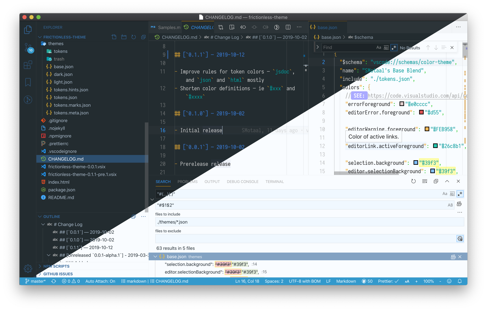

<!--prettier-ignore-start-->

# SMotaal's Frictionless Theme for Visual Studio Code

<!--prettier-ignore-end-->

Frictionless light and dark themes that work for me personally.

> **Note**: This effort is a constant work-in-progress, it evolves with time, and is never really finished — see the [CHANGELOG](./CHANGELOG.md) for updates — you can also manually download and install the latest [pre-release version](./frictionless-theme-0.1.1-pre.1.vsix) directly.

## Light/Dark

This theme defines light and dark variants using a fine-tuned alpha/blending approach. This eliminates the need to actually coerce actual color values and instead (with only a subtle runtime cost) simply rely on the renderer to blend the colors nicely.

The benefits of doing it this way is to avoid hard-coded values showing up where not expected. The pitfalls (aside from slight overhead) is the need to sometimes still override certain elements when the layering does not yield the expected results.

## Icons

This theme borrows from [PKief/vscode-material-icon-theme](https://github.com/PKief/vscode-material-icon-theme) and continues to find ways to simplify things while retaining the absolutely pleasing aspects of this work.
